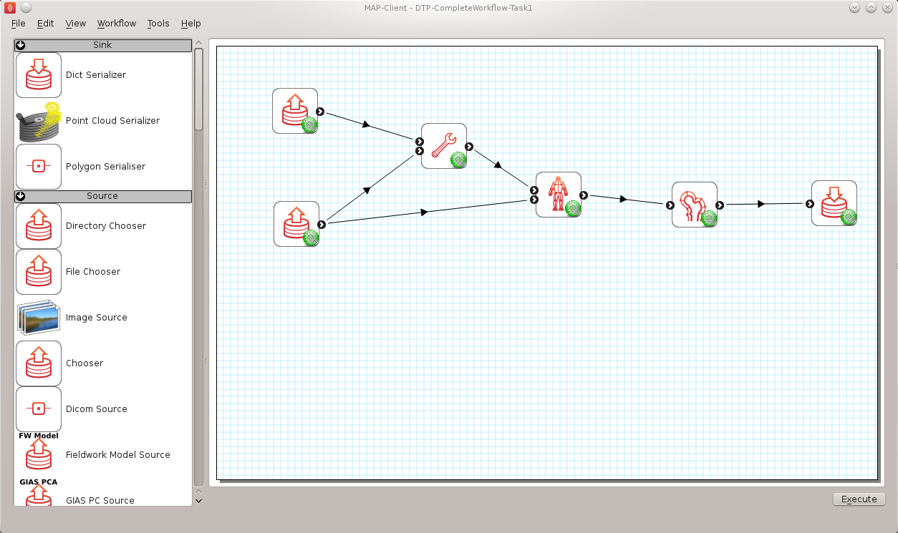
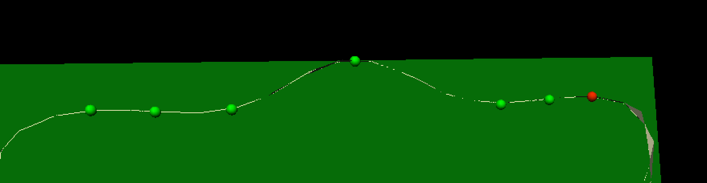
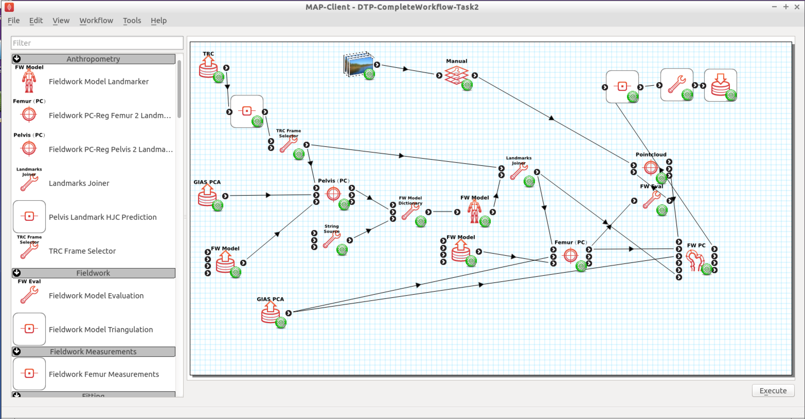
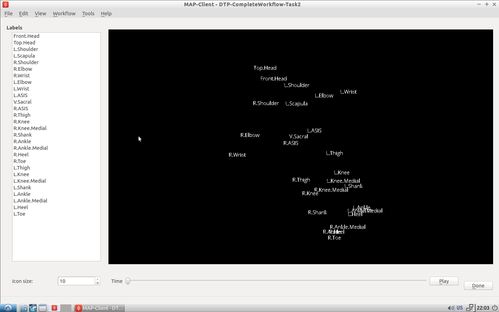

=================
Complete Workflow
=================

This module covers the complete workflow from the acqusition of medical images through to a clinical outcome or clinical tool.  

Overview
========

At this point we have covered the individual stages that take us from some clinical observation or clinical experiment through to creating clinical outcomes.  We shall now turn to looking at a complete workflow, that is starting from some clinical data and finishing with a prediction for clinical use.

In this module we will use the musculoskeletal system to illustrate the complete workflow.  Firstly we will consider the partial case of a complete workflow where we will analyse a horses fetlock joint to gain understanding on wear and abrasion and how this relates to injury.  Then we will look at a much more complete workflow, the femur morphometric workflow, which starts from a set of patient specific anatomical feducial markers and ends with the femur measurements of a specific patient.  The measurements taken from the femur may then be used to provide assistance to a clincian on deciding on a course of action for a positive clinical outcome.

The Musculo-Skeletal System
===========================

The musculo-skeletal (MSK) system ... has a great deal importance in the clinical setting.  With so many people suffering from osteoathritis and other musculo-skeletal diseases the impact of reducing patient suffering is huge.  From a computational physiology aspect we are taking patient measurement and constructing a suitable model that can be used to predict behaviour, for example a wear pattern of a joint acheived through computing joint stress and strain.

MSK Introductory Workflow
=========================

Task one is to have a look at a workflow for the analysis of the horse fetlock joint.  In this workflow we will take a set of measurements that will be used to characterise the joint.  With this information we will predict the liklehood of injury and try to determine a training regime that minimises the risk of injury.

   
   Task 1 workflow horse fetlock characterisation

In this workflow [shown in :numref:`dtp_cp_cwf_tsk1_wkfl`] there are six steps.  It starts with reading in a database of horse fetlock mesh coordinate frame definitions and the selection of a fetlock mesh.  The corresponding coordinate frame definition is read in for the mesh selected and passed to the 'Hoof Measurement' step along with the fetlock mesh itself.  The first three steps in this workflow are non-interactive steps, they are configured proir to executing the workflow.  The 'Hoof Measurement' step is an interactive step for making measurements along the sagittal ridge of the fetlock joint.  

.. figure:: _images/task1initial.png
   :name: dtp_cp_cwf_tsk1_ini
   :align: center
   :alt: Task 1 Initial view
   
   Initial view of the 'Hoof measurement' step

:numref:`dtp_cp_cwf_tsk1_ini` shows the initial view of the 'Hoof Measurement' step.  What we see is some controls on the left handside and on the right a mesh of the fetlock joint cut in half by the segmentation plane.  We are going to measure the height of the sagittal ridge.  To do this we must place seven points along the line of ridge at three different segmentation plane angles.  The seven points must define the line forming the base of the plane and the peak of the ridge.  The order that the points are placed on the segmentation plane is not important, however it is important that the segmentation point used to mark the peak of the ridge is the fourth point counted from the left-hand or right-hand side of the plane.  :numref:`dtp_cp_cwf_tsk1_ridge` shows seven points placed on the segmentation plane with the plane angle set at zero degrees.

   
   Segmented ridge of fetlock joint at 0 degrees
   
As shown, six points are used to define the base plane of the joint with the innermost segmentation points of the plane used to mark the start of the rise of the ridge.  The middle (or fourth point) is used to mark the peak of the ridge.

For the anaylsis of the ridge we are required to segment the ridge at three different segment plane angles.  The angles that we require are +30 degrees, 0 degrees and -30 degrees.  The process for the segmentation at each plane angle is the same as outlined above.

Once we have completed segmenting the sagittal ridge for the three plane angles we have completed the interactive part of this workflow.  The remaining two steps are the 'Hoof Point Anaylzer' step and the 'Dict Serializer' step.

The 'Hoof Point Analyzer' step takes the segmented data and characterises the hoof throught the height and the angle of the sagittal ridge.  This information is then stored to disk in the 'Dict Serializer' step.

At this point the workflow stops but it could carry on to adding the new measurement to a database of such measurements and from there infer from the analysis some risk of injury for the horse.  The next workflow in this section will show a much more comprehensive and complex physiological modelling cycle. 

Patient Femur Analysis Workflow
===============================

Task two is to execute and follow through a (almost) complete computational physiology cycle.  For this task we will take a set of MR images of the knee joint and some fudicial markers taken from the patient so that we can make a set of measurements that are consistent across all patients and provide data for a clinician to prepare the best treatment for the patient.

In :numref:`dtp_cp_cwf_tsk2_wkfl` we have the workflow for analysing a patient's femur.  It is a very complex workflow and by far the most advanced that we have seen.  We can of course use this workflow to analyse any bone that we have the required population based principal component model data for.  At this time we have this data for all the major bones of the lower limb, but here we focus on the femur.

   
   Task 2 patient femur analysis workflow.

This workflow as previously stated is rather complex, it has a number of interactive steps and non-interactive steps.  There are a number of entry points and it is unknown which one you will come across first, so the order of the steps that you work through may not be the same order as written here.

Patient Femur Analysis Overview
-------------------------------

The patient femur analysis workflow starts with four inputs; MR images of the knee joint, motion capture data, population mean hip model, population mean femur model.  Because MR images are expensive and taking a full MR image stack of the femur for a knee joint problem is not feasable we must augment the MR images with motion capture (MOCAP) data of the patient.  In doing this we are able to construct a set of points to fit a femur model to the patient.  In the case of the femur we require some internal points that are not available directly from the MOCAP data, but with the help of a hip model we can determine the internal feature points that are required.  With a patient specific model we are able to take a set of consistent measurements that a clinician can make use of to determine the best course of treatment for the patient.

Workflow walkthrough
--------------------

As stated previously the workflow has four entry points, the order in which they are executed is not determinable so here we follow a possible order from which you might have to deviate.

Luckily two of the entry points are non-interactive and are setup when the steps are configured.  For these steps we are simply selecting a model and the population principal components from which the model can be modified.  We require two models in the case of the femur because the fiducial markers taken from the MOCAP data does not specify the femur hip joint centre that is required for fitting the femur successfully.  To satisfy this requirement we first register the pelvis model and then take the hip joint centre landmarks from the fitted model.  Thus augmenting the fiducial marker set obtained from the MOCAP data.

   
   MOCAP data viewer showing the fiducial markers location and their associated labels.

The first interactive step that occurs when executing the workflow is the MOCAP viewer step (shown in :numref:`bobisyouruncle`).  In this step we can check that the MOCAP data is complete and has the correct names for the markers.  Correct names are not required but it does help the software automatically select the correct fiducial marker later on in the workflow.  It is important however for the fitting of the femur for the MOCAP data to have the knee medial and lateral points marked and anterior superior iliac spine point marked.  In our case we are fitting the left femur so we require these fiducial markers on the left side of the subject.  Using the MOCAP viewer step check that the 'L.Knee', 'L.Knee.Lateral' and 'L.ASIS' fiducial markers are present.  The list box on the left has a list of all the fiducial markers availble and selecting an entry in this list will highlight that marker in the 3D view of the data.

