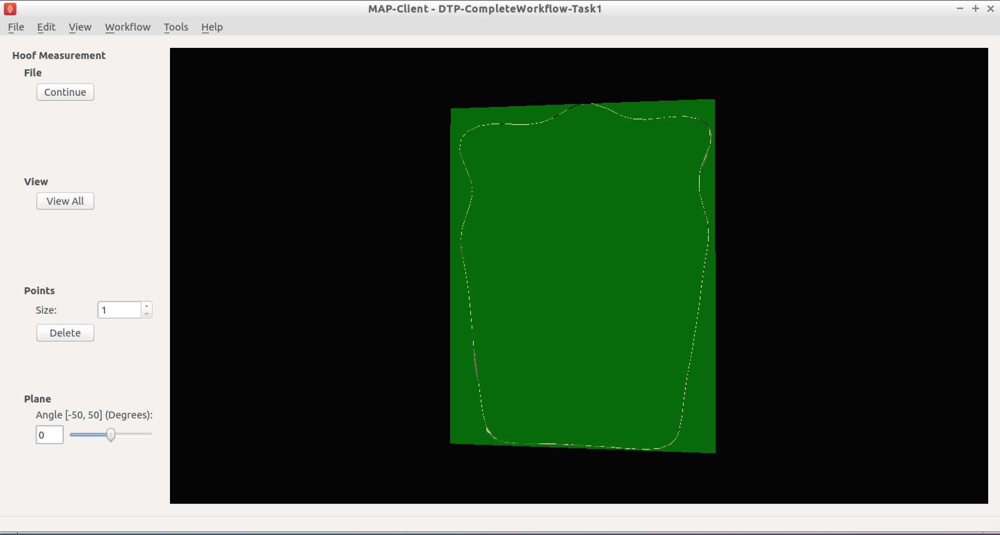

=================
Complete Workflow
=================

This module covers the complete workflow from the acqusition of medical images through to a clinical outcome or clinical tool.  

Overview
========

At this point we have covered the individual stages that take us from some clinical observation or clinical experiment through to creating clinical outcomes.  We shall now turn to looking at a complete workflow, that is starting from some clinical data and finishing with a prediction for clinical use.

In this module we will use the musculoskeletal system to illustrate the complete workflow.  Firstly we will consider the partial case of a complete workflow where we will analyse a horses fetlock joint to gain understanding on wear and abrasion and how this relates to injury.  Then we will look at a much more complete workflow, the femur morphometric workflow, which starts from a set of patient specific anatomical feducial markers and ends with the femur measurements of a specific patient.  The measurements taken from the femur may then be used to provide assistance to a clincian on deciding on a course of action for a positive clinical outcome.

The Musculo-Skeletal System
===========================

The musculo-skeletal (MSK) system ... has a great deal importance in the clinical setting.  With so many people suffering from osteoathritis and other musculo-skeletal diseases the impact of reducing patient suffering is huge.  From a computational physiology aspect we are taking patient measurement and constructing a suitable model that can be used to predict behaviour, for example a wear pattern of a joint acheived through computing joint stress and strain.

MSK Introductory Workflow
=========================

Task one is to have a look at a workflow for the analysis of the horse fetlock joint.  In this workflow we will take a set of measurements that will be used to characterise the joint.  With this information we will predict the liklehood of injury and try to determine a training regime that minimises the risk of injury.

   
   Task 1 workflow horse fetlock characterisation

In this workflow [shown in :numref:`dtp_cp_cwf_tsk1_wkfl`] there are six steps.  It starts with reading in a database of horse fetlock mesh coordinate frame definitions and the selection of a fetlock mesh.  The corresponding coordinate frame definition is read in for the mesh selected and passed to the 'Hoof Measurement' step along with the fetlock mesh itself.  The first three steps in this workflow are non-interactive steps, they are configured proir to executing the workflow.  The 'Hoof Measurement' step is an interactive step for making measurements along the sagittal ridge of the fetlock joint.  

   
   Initial view of the 'Hoof measurement' step

:numref:`dtp_cp_cwf_tsk1_ini` shows the initial view of the 'Hoof Measurement' step.  What we see is some controls on the left handside and on the right a mesh of the fetlock joint cut in half by the segmentation plane.  We are going to measure the height of the sagittal ridge.  To do this we must place seven points along the line of ridge at three different segmentation plane angles.  The seven points must define the line forming the base of the plane and the peak of the ridge.  The order that the points are placed on the segmentation plane is not important, however it is important that the segmentation point used to mark the peak of the ridge is the fourth point counted from the left-hand or right-hand side of the plane.  :numref:`dtp_cp_cwf_tsk1_ridge` shows seven points placed on the segmentation plane with the plane angle set at zero degrees.

   
   Segmented ridge of fetlock joint at 0 degrees
   
As shown, six points are used to define the base plane of the joint with the innermost segmentation points of the plane used to mark the start of the rise of the ridge.  The middle (or fourth point) is used to mark the peak of the ridge.

For the anaylsis of the ridge we are required to segment the ridge at three different segment plane angles.  The angles that we require are +30 degrees, 0 degrees and -30 degrees.  The process for the segmentation at each plane angle is the same as outlined above.

Once we have completed segmenting the sagittal ridge for the three plane angles we have completed the interactive part of this workflow.  The remaining two steps are the 'Hoof Point Anaylzer' step and the 'Dict Serializer' step.

The 'Hoof Point Analyzer' step takes the segmented data and characterises the hoof throught the height and the angle of the sagittal ridge.  This information is then stored to disk in the 'Dict Serializer' step.

At this point the workflow stops but it could carry on to adding the new measurement to a database of such measurements and from there infer from the analysis some risk of injury for the horse.  The next workflow in this section will show a much more comprehensive and complex physiological modelling cycle. 

Patient Femur Analysis Workflow
===============================

Task two is to execute and follow through a (almost) complete computational physiology cycle.  For this task we will take a set of MR images of the knee joint and some fudicial markers taken from the patient so that we can make a set of measurements that are consistent across all patients and provide data for a clinician to prepare the best treatment for the patient.

In :numref:`dtp_cp_cwf_tsk2_wkfl` we have the workflow for analysing a patient's femur.  It is a very complex workflow and by far the most advanced that we have seen.  We can of course use this workflow to analyse any bone that we have the required population based principal component model data for.  At this time we have this data for all the major bones of the lower limb, but here we focus on the femur.

   
   Task 2 patient femur analysis workflow.

This workflow as previously stated is rather complex, it has a number of interactive steps and non-interactive steps.  There are a number of entry points and it is unknown which one you will come across first, so the order of the steps that you work through may not be the same order as written here.

Patient Femur Analysis Overview
-------------------------------

The patient femur analysis workflow starts with four inputs; MR images of the knee joint, motion capture data, population mean hip model, population mean femur model.  Because MR images are expensive and taking a full MR image stack of the femur for a knee joint problem is not feasable we must augment the MR images with motion capture (MOCAP) data of the patient.  In doing this we are able to construct a set of points to fit a femur model to the patient.  In the case of the femur we require some internal points that are not available directly from the MOCAP data, but with the help of a hip model we can determine the internal feature points that are required.  With a patient specific model we are able to take a set of consistent measurements that a clinician can make use of to determine the best course of treatment for the patient.

Workflow walkthrough
--------------------

As stated previously the workflow has four entry points, the order in which they are executed is not determinable so here we follow a possible order from which you might have to deviate.

Luckily two of the entry points are non-interactive and are setup when the steps are configured.  For these steps we are simply selecting a model and the population principal components from which the model can be modified.  We require two models in the case of the femur because the fiducial markers taken from the MOCAP data does not specify the femur hip joint centre that is required for fitting the femur successfully.  To satisfy this requirement we first register the pelvis model and then take the hip joint centre landmarks from the fitted model.  Thus augmenting the fiducial marker set obtained from the MOCAP data.

   
   MOCAP data viewer showing the fiducial markers location and their associated labels.

The first interactive step that occurs when executing the workflow is the MOCAP viewer step (shown in :numref:`dtp_cp_cwf_tsk2_mocap`).  In this step we can check that the MOCAP data is complete and has the correct names for the markers.  Correct names are not required but it does help the software automatically select the correct fiducial marker later on in the workflow.  It is important however for the fitting of the femur for the MOCAP data to have the knee medial and lateral points marked and anterior superior iliac spine point marked.  In our case we are fitting the left femur so we require these fiducial markers on the left side of the subject.  Using the MOCAP viewer step check that the 'L.Knee', 'L.Knee.Lateral', 'L.ASIS' and 'V.SACRAL' fiducial markers are present.  The list box on the left has a list of all the fiducial markers availble and selecting an entry in this list will highlight that marker in the 3D view of the data.

When you are satisfied that these feducial markers are present continue on to the next step.  The next step is the segmentation step, we need to segment the distal end of the femur so that we can fit the model to later.  We do not require a lot of segmentation points for the fit an advantage afforded to us when using PCA models.

Segmentation Step
-----------------

The segmentation step is a reasonably advanced step that affords us the ability of segmenting an image stack with individual segmentation points or besier curves.  It also allows us to manipulate the segmentation plane in two ways; the first is the ability to move the plane in the direction of the normal for the plane, the second is the ability to change the orientation of the plane.  These four modes are available through the toolbar at the top of the window (:numref:`dtp_cp_cwf_tsk2_seg_toolbar`).

   
   Segmentation toolbar showing the icons for the different tools available to the user.

Segment
+++++++

In the segment mode segmentation points can be added by using the ctrl key modifier and the left mouse button.  Unwanted segmentation points can be removed by selecting them and pressing the delete key or using the delete button on the segmentation panel on the left-hand side.  Note that it is not possible to delete a besier curve using the segmentation point delete button or vice versa.

Beseir
++++++

In the Beseir mode segmentation points can be added along a curve defined by control points with extra segmentation points placed between the control points automatically, the number of automatically added segmentation points can be changed through the spin box in the Beseir panel on the left-hand side.  Besier curves can be deleted by first selecting a curve and pressing the delete key or throught the delete button under the Besier panel.  Note that it is not possible to delete a segmentation point when using the Besier curve delete button or vice versa.

Normal
++++++

In the normal mode a yellow arrow will be visible this arrow represents the normal of the segmentation plane.  With the normal arrow selected (when selected the arrow will be orange) we can move the segmentation plane forwards and backwards in the direction of the segmenation plane normal.

Orientation
+++++++++++

In the orientation mode a purple sphere will be visible in the centre of the segmentation plane.  In this mode when we attempt to orient the scene with the left mouse button it is the segmentation plane that is oreintated and not the scene.

For our needs in this situation we don't require to segment every feature to the minutest of details.  We do need to concentrate on getting the pertinent aspects of the distal end of the femur segmented though.  Segmenting the condials and XXXXX parts of the femur is a must, essentially we must add segmentation points over the features of the femur to enable an accurate final fit of the model.  Because we are targeting a segmentation for a PCA based model we can segment as little as 20 points and still achieve a satisfactory result.

You are able to load a pre-prepared segmentation using the load button on under the file tab.  It is also possible to save your own segmentation using the save button under the file tab.  But beware that at this point you can only havea single saved segmention, so using the save button will overwrite the pre-prepared segmentation.

Once the segmentation is finished continue on to the registration phase of the workflow.

Registration
------------

The registration phase of the workflow consists of registering the population based model of the hip and femur to the MOCAP fiducial markers, we also need to register the segmentation points defined in image coordinate system to the patient coordinate system.

In :numref:`dtp_cp_cwf_tsk2_reg_pelvis` we see on the left-hand side a list of check boxes for controlling the visibility of the fiducial markers, five combo boxes to assign model landmark points to fiducial marker points, four buttons to perfom a registration and reject or accept the registration, two boxes that display error measurements of the fitted model and some controls for taking a screen shot.  On the right-hand side we see a 3D view of the pelvis model and the fiducial markers.

   
   Initial view of the register pelvis step.

To register the pelvis model to the fiducial markers we must assign the model landmark points to the appropriate fiducial markers.  For the registration to work we must choose at least three points that are not co-linear.  The landmark points 'L.ASIS', 'R.ASIS' and 'V.SACRAL' satisfy this condition, we need to set the combo boxes to have the correct values.  :numref:`dtp_cp_cwf_tsk2_reg_pela` shows the correct associations.

   
   Association of pelvis model landmarks to fiducial markers.

With the correct associations made we can register the model to the markers.  The registration process is a three stage process (and if we watch carefully we can see the three stages as they happen); stage one rigid body fit, stage two rigid body fit plus first principal component, stage three rigid body fit plus the first three pricipal components.

Press the register button to perform the registration, if the fit looks correct accept it to continue with the workflow.

Now it is time to register the femur to the subjects feducial markers, in :numref:`dtp_cp_cwf_tsk2_reg_femur` we see a very similar interface to what was seen in the registration of the pelvis (:numref:`dtp_cp_cwf_tsk2_reg_pelvis`).  The only difference is that now we have a different set of model landmarks that we are required to associate.  If we look at the pelvis region in the 3D view we can see that now there are new feducial markers that were not present in the original MOCAP data.  These of course have been generated from the pelvis model so that we can make use of virtual internal markers for fitting the femur.

   
   Initial view of the register femur step.

Again we need to associate at least three points that are not co-linear, which is why we required the pelvis model.  The first two points that we can identify for the femur registration are the knee medial and knee lateral feducial markers.  But we do not have a third feducial marker which we can choose to associate with the femur.  However, from the pelvis model we can use the femoral head joint centre landmark as the third point for the registration.  :numref:`dtp_cp_cwf_tsk2_reg_fema` shows the correct associations for the left femur model.

   
   Association of femur model landmarks to fiducial markers.

Press the register button to perform the registration, if the fit looks correct accept it to continue with the workflow.

At this point in the workflow we need to register the segmented point cloud in magnet coordinates of the images to the subject feducial marker coordinate system.  :numref:`dtp_cp_cwf_tsk2_reg_pc`

   
   Initial view of the register segmented point cloud step.

Again we have a related interface to the two previous registration steps with a few differences.  Now instead of five comboboxes we have only one, the only combobox allows us to choose the type of registration to perform.  In this situation we want to perform an iterative closest point (ICP) source to target registration.  If we were to set this registration type in the registration type combobox and push the register button we get the result as seen in :numref:`dtp_cp_cwf_tsk2_reg_pc_0`.

   
   Result of registering the segmented point cloud using ICP source-target registration method with the default settings.

We can see here that some of the segmented points do not correspond very well to the point cloud generated from the femur model, this should not be the case we should have a good correspondence between segmented points and model points.  The reason for this discrepency is because the ICP algorithm is very sensitive to initial alignment and the minimum value the algorithm has converged to is a local minimum which is not the global minimum in the solution space.  To get a better registration we need to set the initial rotation of the segmented point cloud.  In the initial rotation line edit boxes set the values to 0, 90, -45.  If you haven't already, use the reset push button to reset the registration and push the register button to perform the registration with the new initial values (see :numref:`dtp_cp_cwf_tsk2_reg_pc_s` for the correct settings).  We should now see a much better alignment of the two point clouds

   
   Settings for the ICP source-target registration method.

Have a look at the fit, if we do not have enough segmented points it will be difficult for the ICP registration to find a satisfactory fit to the model point cloud.  In this situation, to get a satisfactory fit, we need to set the initial values so that they are very close to the final values making the registration via ICP redundant.

When you have a satisfactory registration push the accept button.

We have now arrived at the last interactive step in this workflown (:numref:`dtp_cp_cwf_tsk2_fit_model`).  We need to fit the PCA femur model to the segmented point cloud.  Again we see a very similar interface as we have seen previously in the registration steps the difference is that we now have a fitting parameters section.  For the fitting we want to fit the datapoints to the element points (DPEP), set the distance model combobox to DPEP to make sure that the we are doing the fit in the correct direction.

   
   Initial view of the model fitting step.

If we now fit the data to the model, using the fit push button, we see that the model has been fitted to the segmented point cloud.  We can also see that the top of the femur has moved quite a bit as well, this is because we have not constrained that part of the model with any datapoints and thus it is free to move.  We can, if so desired, pin the femoral head to the hip joint centre landmark to change this behaviour.  For the purposes of this exercise we won't do this but it is something to keep in mind.  :numref:`dtp_cp_cwf_tsk2_fit_model_final` shows the final fitted model in yellow.

   
   The reference model (red) and the final fitted model (yellow). 

When we push the accept button the workflow will finish to it's conclusion.  The last few remaining steps take measurements from the femur model and save them to disk.  The idea here is that the measurements will be used to inform a clinician or be used in a tool to aide in the subjects treatment.

